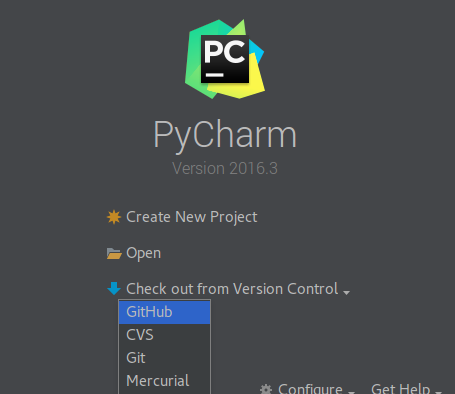
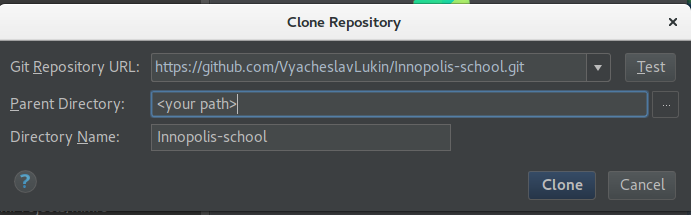
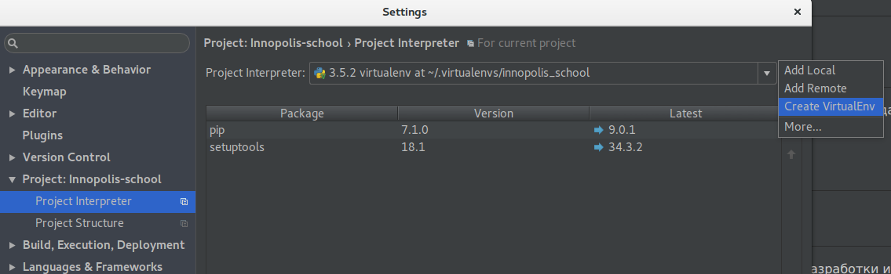
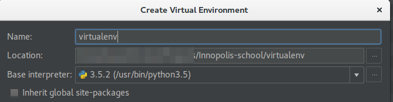

# О проекте
Совместно с ребятами из школы Иннополис создаем сайт для школы.

<aside class="notice">
Все инструкции для Linux.
</aside>

# С чего начать
## Установка ПО
1. Установить IDE [PyCharm](https://www.jetbrains.com/pycharm/). Т.к. для разработки используется `python`, то логично использовать именно эту среду разработки.
2. Установить `virtualenv`.  
В Linux это делается одной командой:
`pip install virtualenv`.
Болле подробно можно посмотреть [здесь](https://virtualenv.pypa.io/en/stable/userguide/)
3. Установить git (если он еще не установлен). Как это сделать, можно почитать [здесь](https://git-scm.com/book/ru/v1/%D0%92%D0%B2%D0%B5%D0%B4%D0%B5%D0%BD%D0%B8%D0%B5-%D0%A3%D1%81%D1%82%D0%B0%D0%BD%D0%BE%D0%B2%D0%BA%D0%B0-Git)

## Настройка среды разработки
1. Клонировать репозиторий из git
В PyCharm создаем проект

В настройках указываем наш git репозиторий и путь проекта, где будет лежать проект.

Другой вариант, использовать консоль:

    git clone https://github.com/VyacheslavLukin/Innopolis-school.git
    
2. В PyCharm необходимо настроить интерпретатор, чтобы он использовал `virtualenv`, для этого нужно сделать следующее:
- Зайти в ``File -> Settings -> Project:Innopolis-school``

`virtualenv` будет лежать прям в папке проекта, поэтому указываем путь проекта

3. Установка зависимостей проекта `pip install -r requirements.txt`

# Что дальше?
1. Проверить, что окружение настроено правильно - запустить веб-сервер flask
`./run.py`

В браузере перейти на ``http://localhost:5000`` и увидеть **Hello World!**